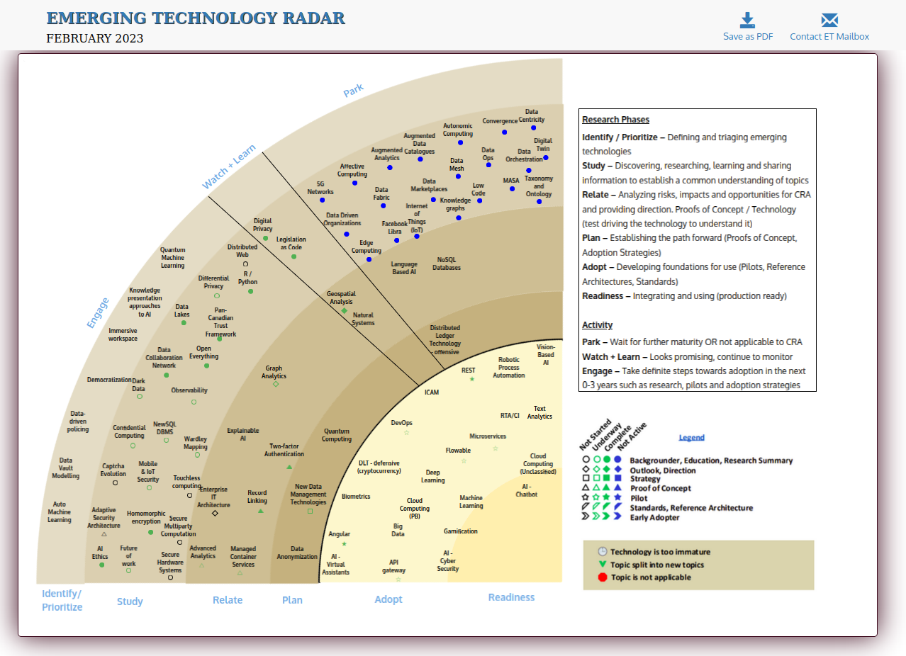

# Emerging Technologies Radar

This is a Gartner influenced [emerging technologies radar](https://blogs.gartner.com/tuong-nguyen/2020/12/07/gartner-launches-emerging-technologies-radar-2021/) that tracks the progress of emerging technology research in an organization. It is a sample* of the radar that we use at the IT branch at Canada Revenue Agency (CRA). The original radar design and update process is entirely manual at this moment, using Microsoft Visio. This is an attempt to automate the entire process to create an end-to-end solution, aka **1-click radar generation**.

The canvas below and all of its contents have been automatically generated from a single spreadsheet. The technology names are automatically placed on the canvas without** hard coding any of their coordinates.

**I am no longer working on this project.** Below are some of the next steps that were in the pipeline:
1. Add activity icons to each technology to track activity/deliverable level progress
2. Add hyperlinks to each technology name for which reference material is available
3. Automatically fine tune coordinates so that the titles and icons do not overlap
4. Add legends and definitions
5. Activate the buttons on the top right corner
6. Make the web design responsive
7. Create a webform and link it to the radar's backend to allow real-time updates
8. Upgrade the spreadsheet to a database
9. Use machine learning to tune all the parameters as new data comes in
   - There are 11 parameters that sometimes I need to tune manually (not all at the same time) to align items properly
10. Use a JavaScript framework to streamline development that adheres to current industry standards.

## **[Deployed Website](https://dg1223.github.io/tech-radar/)**

&ast; The date on the top left corner below the header does not correspond to the current state of CRA's emerging technology research.

&ast;&ast; Some parameters need manual tuning so that the texts and icons align properly with each other. See step 9 of the next steps for a possible solution to automate this.
